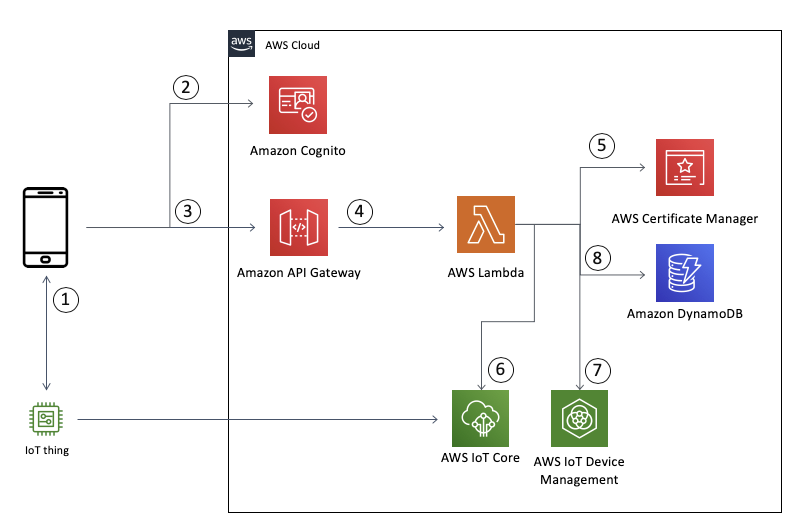
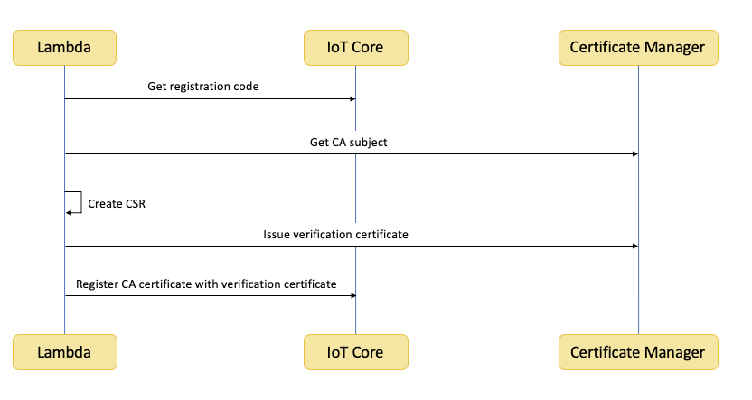
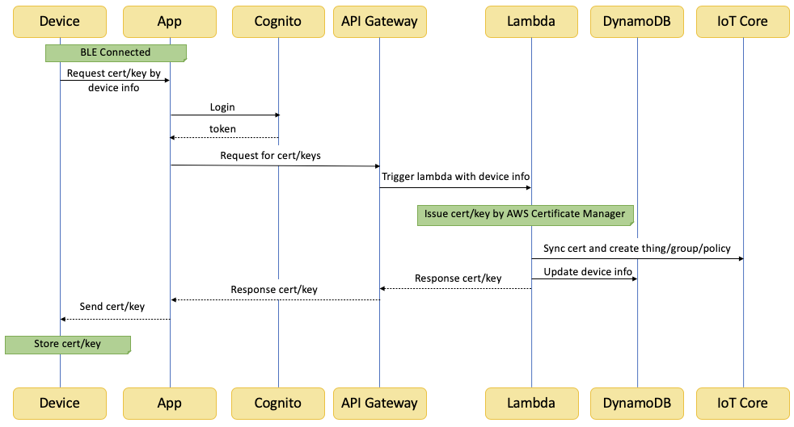

# aws-iot-device-provisioning-with-certificate-manager

## What problem this tool is solving?

To on board a device to AWS IoT while the device does not carry a valid certificate from the factory, the operator of IoT devices needs to manage these procedures securely:

1. Purchase a Certificate Authority for the product;  securely store it physically;  enforce strict access restrictions;  log each and every use of it securely.
2. Generate large number of certificates;  provision such certificates into each and every device securely.  If the provisioning is performed outside of factory, design and implement a reliable mechanism for authenticating the device, so that only authentic devices will be provisioned.
3. Register the CA as well as each and every certificate with AWS IoT Core, so that the provisioned devices can connect to AWS services.
4. Renew the CA and the certificates before the expiration date.  Register the renewed CA with AWS IoT Core; provision the renewed certificates to each and every device.

This project provides a solution that you can deploy into your AWS account, to simplify the procedure of onboarding IoT devices to AWS.  You do this without the need of provisioning devices in the factory.  This solution uses the [AWS Certificate Manager](https://aws.amazon.com/certificate-manager/) to generate and manage large number of certificates securely;  it uses [Amazon Cognito](https://aws.amazon.com/cognito/) to authenticate end users, then provision device certificate through the end user’s mobile app.  By using this solution, the operator of IoT devices can manage the procedure of #1 -#4 centrally and securely in AWS.

## Architecture



1. User installs an app on the mobile phone.  This app is owned by either the manufacturer, or the operator of the IoT device.
2. User logins in with [Amazon Cognito](https://aws.amazon.com/cognito/), and acquires a token.
3. APP sends a http request through [Amazon API Gateway](https://aws.amazon.com/api-gateway/) appended with the device ID (e.g. a serial number) to Amazon API gateway.  The device’s ID can be scan from bar code, or keyed in by user.
4. Amazon API Gateway triggers an [AWS Lambda](https://aws.amazon.com/lambda/) function to validate the API request payload.
5. The Lambda function retrieves a new certificate from AWS Certificate Manager.
6. The Lambda function registers the certificate with AWS IoT Core, also creates a policy and attaches it to the certificate.
7. The Lambda function creates a new thing/thing group and associate it with the certificate in AWS IoT Core.
8. The Lambda function stores the device’s management information in [Amazon DynamoDB](https://aws.amazon.com/dynamodb/).

## Sequence Diagram



This flow chart shows the way to register your CA to AWS IoT Core. After the CA from Certificate Manager is registered, the device can use the certificate from Certificate Manager instead of using the certificate from AWS IoT Core. The details is from [Create Your Own Client Certificate](https://docs.aws.amazon.com/iot/latest/developerguide/device-certs-your-own.html).




This flow chart shows the provisioning flow between target device, provisioning app and the API. The project contains source code and supporting files for a serverless application shown in the architecture diagram.  You can deploy it into your AWS account by using the SAM CLI. It includes the following files and folders.

* provisioning_lambda - Code for the provisioning API.
* deployment_lambda - Code for custom resource in CloudFormation template.
* template.yaml - A template that defines the application's AWS resources.

The application uses several AWS resources, including AWS Certificate Manager, Amazon DynamoDB, AWS IoT Core, Amazon Cognito, Lambda functions and an API from API Gateway. These resources are defined in the `template.yaml` file in this project. You can update the template to add AWS resources through the same deployment process that updates your application code. The subjects of CA is defined at line 488. You can change the contents for your needs.

If you prefer to use an integrated development environment (IDE) to build and test your application, you can use the AWS Toolkit.  

The AWS Toolkit is an open source plug-in for popular IDEs that uses the SAM CLI to build and deploy serverless applications on AWS. The AWS Toolkit also adds a simplified step-through debugging experience for Lambda function code. See the following links to get started.


* [PyCharm](https://docs.aws.amazon.com/toolkit-for-jetbrains/latest/userguide/welcome.html)
* [IntelliJ](https://docs.aws.amazon.com/toolkit-for-jetbrains/latest/userguide/welcome.html)
* [VS Code](https://docs.aws.amazon.com/toolkit-for-vscode/latest/userguide/welcome.html)
* [Visual Studio](https://docs.aws.amazon.com/toolkit-for-visual-studio/latest/user-guide/welcome.html)

This project **does not **contain a sample mobile app.  Here are some tips for you to create one. The app should have a way to communicate with the target device. We assume you can use BLE to connect it. The device need to check if it has a valid certificate and private key or not. If it does not have them, it will do BLE advertising and wait for the provisioning app connect to it. Once the device gets the certificate/private key from app, it needs to store these file in a secure storage. For example, if the target device is an Android device, it can store the certificate/private key in Android keystore system.

The [AWS BLE demo](https://docs.aws.amazon.com/freertos/latest/userguide/ble-demo.html) links to mobile SDKs that you can take advantage of for developing the mobile app.


## API

**Request**

```
HTTP POST https://{endpoint}/certificate
Content-Type: application/json
BODY: {
    "DSN": String,
    "publicKey": String
}
```

DSN: The device serial number (required)
publicKey: The base64-encoded X25519 public key from device (required). Device should generate a X25519 key pair and keep the private key by itself.

**Response**

```
HTTP 200
BODY: {
    "certificatePem": String,
    "encryptedPrivateKey": String,
    "publicKey": String
}
```

certificatePem: X.509 certificate
encryptedPrivateKey: X.509 private key which is encrypted by secret key. The secret key can be generated by device's private key and the public key from response payload.
publicKey: The base64-encoded X25519 public key from remote server for secret key generation.

## Customize config

You can modify the config from `provisioning_lambda/config.json`

```
{
    "certificate": {
        "subject": {
            "CN": "Common Name (e.g. server FQDN or YOUR name)",
            "O": "Organization Name (for example, company)",
            "OU": "Organizational Unit Name (for example, section)",
            "L": "Locality Name (for example, city)",
            "ST": "State or Province Name (full name)",
            "C": "Country Name (for example, US)"
        },
        "Validity": Integer. Validity for CA certificate (year)
    },
    "iot": {
        "certValidity": Integer. Should be less than certificate's validity (year)
        "thingPrefix": "Prefix for thing name in AWS IoT Core",
        "thingGroup": "Thing group name"
    }
}
```

## Deploy the sample application

The Serverless Application Model Command Line Interface (SAM CLI) is an extension of the AWS CLI that adds functionality for building and testing Lambda applications. It uses Docker to run your functions in an Amazon Linux environment that matches Lambda. It can also emulate your application's build environment and API.

To use the SAM CLI, you need the following tools.


* SAM CLI - [Install the SAM CLI](https://docs.aws.amazon.com/serverless-application-model/latest/developerguide/serverless-sam-cli-install.html)
* [Python 3 installed](https://www.python.org/downloads/)
* Docker - [Install Docker community edition](https://hub.docker.com/search/?type=edition&offering=community)

To build and deploy your application for the first time, run the following in your shell:


```
sam build --use-container
sam deploy --guided
```


The first command will build the source of your application. The second command will package and deploy your application to AWS, with a series of prompts:


* **Stack Name**: The name of the stack to deploy to CloudFormation. This should be unique to your account and region, and a good starting point would be something matching your project name.
* **AWS Region**: The AWS region you want to deploy your app to.
* **Confirm changes before deploy**: If set to yes, any change sets will be shown to you before execution for manual review. If set to no, the AWS SAM CLI will automatically deploy application changes.
* **Allow SAM CLI IAM role creation**: Many AWS SAM templates, including this example, create AWS IAM roles required for the AWS Lambda function(s) included to access AWS services. By default, these are scoped down to minimum required permissions. To deploy an AWS CloudFormation stack which creates or modified IAM roles, the `CAPABILITY_IAM` value for `capabilities` must be provided. If permission isn't provided through this prompt, to deploy this example you must explicitly pass `--capabilities CAPABILITY_IAM` to the `sam deploy` command.
* **Save arguments to samconfig.toml**: If set to yes, your choices will be saved to a configuration file inside the project, so that in the future you can just re-run `sam deploy` without parameters to deploy changes to your application.

You can find your API Gateway Endpoint URL in the output values displayed after deployment.

## Example

After CloudFormation is deployed, you can follow the steps below to use the provisioning API.

1. Prepare Cognito User Pool information for app integration
    1. Go to Cognito User Pool Console, find **IoTProvisioningUser**.
    2. Copy **Pool Id**, **App client id **and **App client secret**.
2. Use Cognito authentication library to perform login action.
    1. The details can be found at https://docs.aws.amazon.com/cognito/latest/developerguide/cognito-integrate-apps.html
    2. Example: https://github.com/awslabs/aws-sdk-android-samples/tree/main/AmazonCognitoYourUserPoolsDemo
3. After login successfully, you will get token from Cognito service. Then you can get device certificate and private key from API endpoint.

```bash
curl -k -d '{"DSN": <Device Serial Number>}' -H "Content-Type: application/json" \
-H "Authorization: <Cognito Auth Token>" -X POST \
https://<api ID>.execute-api.<region>.amazonaws.com/Beta/certificate
```

This project also contains a example with two python scripts. You can test the provisioning flow by running `device.py` and `provisioning_app.py`.

The dependencies of the scripts are defined in `example/requirements.txt`. You can install the dependencies by following command.

```shell
pip3 install -r example/requirements.txt
```

Then execute device script.

```shell
python3 device.py
```

Execute provisioning_app.py

```
python3 provisioning_app.py
```

You can get the result from your terminal for better understanding of the provisioning flow.


## Cleanup

To delete the sample application that you created, use the AWS CLI. Assuming you used your project name for the stack name, you can run the following:


```
aws cloudformation delete-stack --stack-name aws-iot-device-provisioning
```


## Resources

See the [AWS SAM developer guide](https://docs.aws.amazon.com/serverless-application-model/latest/developerguide/what-is-sam.html) for an introduction to SAM specification, the SAM CLI, and serverless application concepts.

Next, you can use AWS Serverless Application Repository to deploy ready to use Apps that go beyond hello world samples and learn how authors developed their applications: [AWS Serverless Application Repository main page](https://aws.amazon.com/serverless/serverlessrepo/)
